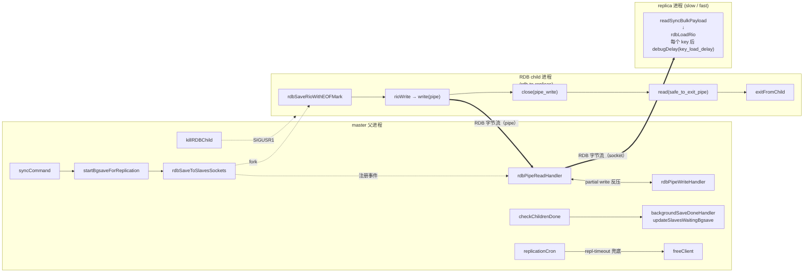
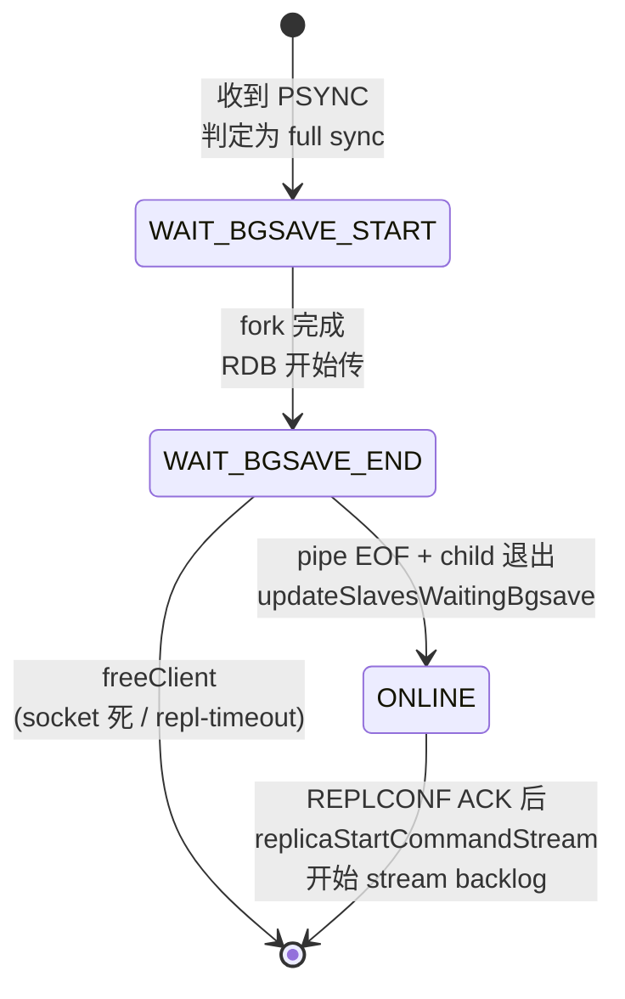

### 原测试TCL代码解析

```shell
# test diskless rdb pipe with multiple replicas, which may drop half way
start_server {tags {"repl external:skip tsan:skip"} overrides {save ""}} {
    set master [srv 0 client]
    $master config set repl-diskless-sync yes
    $master config set repl-diskless-sync-delay 5
    $master config set repl-diskless-sync-max-replicas 2
    set master_host [srv 0 host]
    set master_port [srv 0 port]
    set master_pid [srv 0 pid]
    # put enough data in the db that the rdb file will be bigger than the socket buffers
    # and since we'll have key-load-delay of 100, 20000 keys will take at least 2 seconds
    # we also need the replica to process requests during transfer (which it does only once in 2mb)
    $master debug populate 20000 test 10000
    $master config set rdbcompression no
    $master config set repl-rdb-channel no
    # If running on Linux, we also measure utime/stime to detect possible I/O handling issues
    set os [catch {exec uname}]
    set measure_time [expr {$os == "Linux"} ? 1 : 0]
    foreach all_drop {no slow fast all timeout} {
        test "diskless $all_drop replicas drop during rdb pipe" {
            set replicas {}
            set replicas_alive {}
            # start one replica that will read the rdb fast, and one that will be slow
            start_server {overrides {save ""}} {
                lappend replicas [srv 0 client]
                lappend replicas_alive [srv 0 client]
                start_server {overrides {save ""}} {
                    lappend replicas [srv 0 client]
                    lappend replicas_alive [srv 0 client]

                    # start replication
                    # it's enough for just one replica to be slow, and have it's write handler enabled
                    # so that the whole rdb generation process is bound to that
                    set loglines [count_log_lines -2]
                    [lindex $replicas 0] config set repl-diskless-load swapdb
                    [lindex $replicas 1] config set repl-diskless-load swapdb
                    [lindex $replicas 0] config set key-load-delay 100 ;# 20k keys and 100 microseconds sleep means at least 2 seconds
                    [lindex $replicas 0] replicaof $master_host $master_port
                    [lindex $replicas 1] replicaof $master_host $master_port

                    # wait for the replicas to start reading the rdb
                    # using the log file since the replica only responds to INFO once in 2mb
                    wait_for_log_messages -1 {"*Loading DB in memory*"} 0 1500 10

                    if {$measure_time} {
                        set master_statfile "/proc/$master_pid/stat"
                        set master_start_metrics [get_cpu_metrics $master_statfile]
                        set start_time [clock seconds]
                    }

                    # wait a while so that the pipe socket writer will be
                    # blocked on write (since replica 0 is slow to read from the socket)
                    after 500

                    # add some command to be present in the command stream after the rdb.
                    $master incr $all_drop

                    # disconnect replicas depending on the current test
                    if {$all_drop == "all" || $all_drop == "fast"} {
                        exec kill [srv 0 pid]
                        set replicas_alive [lreplace $replicas_alive 1 1]
                    }
                    if {$all_drop == "all" || $all_drop == "slow"} {
                        exec kill [srv -1 pid]
                        set replicas_alive [lreplace $replicas_alive 0 0]
                    }
                    if {$all_drop == "timeout"} {
                        $master config set repl-timeout 2
                        # we want the slow replica to hang on a key for very long so it'll reach repl-timeout
                        pause_process [srv -1 pid]
                        after 2000
                    }

                    # wait for rdb child to exit
                    wait_for_condition 500 100 {
                        [s -2 rdb_bgsave_in_progress] == 0
                    } else {
                        fail "rdb child didn't terminate"
                    }

                    # make sure we got what we were aiming for, by looking for the message in the log file
                    if {$all_drop == "all"} {
                        wait_for_log_messages -2 {"*Diskless rdb transfer, last replica dropped, killing fork child*"} $loglines 1 1
                    }
                    if {$all_drop == "no"} {
                        wait_for_log_messages -2 {"*Diskless rdb transfer, done reading from pipe, 2 replicas still up*"} $loglines 1 1
                    }
                    if {$all_drop == "slow" || $all_drop == "fast"} {
                        wait_for_log_messages -2 {"*Diskless rdb transfer, done reading from pipe, 1 replicas still up*"} $loglines 1 1
                    }
                    if {$all_drop == "timeout"} {
                        wait_for_log_messages -2 {"*Disconnecting timedout replica (full sync)*"} $loglines 1 1
                        wait_for_log_messages -2 {"*Diskless rdb transfer, done reading from pipe, 1 replicas still up*"} $loglines 1 1
                        # master disconnected the slow replica, remove from array
                        set replicas_alive [lreplace $replicas_alive 0 0]
                        # release it
                        resume_process [srv -1 pid]
                    }

                    # make sure we don't have a busy loop going thought epoll_wait
                    if {$measure_time} {
                        set master_end_metrics [get_cpu_metrics $master_statfile]
                        set time_elapsed [expr {[clock seconds]-$start_time}]
                        set master_cpu [compute_cpu_usage $master_start_metrics $master_end_metrics]
                        set master_utime [lindex $master_cpu 0]
                        set master_stime [lindex $master_cpu 1]
                        if {$::verbose} {
                            puts "elapsed: $time_elapsed"
                            puts "master utime: $master_utime"
                            puts "master stime: $master_stime"
                        }
                        if {!$::no_latency && ($all_drop == "all" || $all_drop == "slow" || $all_drop == "timeout")} {
                            assert {$master_utime < 70}
                            assert {$master_stime < 70}
                        }
                        if {!$::no_latency && ($all_drop == "none" || $all_drop == "fast")} {
                            assert {$master_utime < 15}
                            assert {$master_stime < 15}
                        }
                    }

                    # verify the data integrity
                    foreach replica $replicas_alive {
                        # Wait that replicas acknowledge they are online so
                        # we are sure that DBSIZE and DEBUG DIGEST will not
                        # fail because of timing issues.
                        wait_for_condition 150 100 {
                            [lindex [$replica role] 3] eq {connected}
                        } else {
                            fail "replicas still not connected after some time"
                        }

                        # Make sure that replicas and master have same
                        # number of keys
                        wait_for_condition 50 100 {
                            [$master dbsize] == [$replica dbsize]
                        } else {
                            fail "Different number of keys between master and replicas after too long time."
                        }

                        # Check digests
                        set digest [$master debug digest]
                        set digest0 [$replica debug digest]
                        assert {$digest ne 0000000000000000000000000000000000000000}
                        assert {$digest eq $digest0}
                    }
                }
            }
        }
    }
}
```

#### server 0的含义

```
start_server {tags {"repl external:skip tsan:skip"} overrides {save ""}} {
```
这行代码，启动一个master server。

代码24行的 `start_server` 是启动一个 replica。
```
start_server {overrides {save ""}} {
```

Tcl 测试框架里 `srv N` 的约定是 越靠近当前作用域内层、N 越大：当前 `start_server` 块内 `srv 0` 永远是“最近一次启动的那个 server”，往外走依次是 `srv -1`、`srv -2`，所以当测试执行时，进入到最内层的 start_server 之后：

| srv 索引   | 实际指向           |
| -------- | -------------- |
| `srv 0`  | 第二个启动的 replica |
| `srv -1` | 第一个启动的 replica |
| `srv -2` | master         |

#### fast和slow怎么来的

```
[lindex $replicas 0] config set key-load-delay 100
```

 `key-load-delay` 是 replica 端 的配置，用于控制 replica 加载 RDB 时每写入一个 key 之间 sleep 多少微秒，定义在 `src/config.c`，运行时由 `rdbLoadObject` 之类的代码读到。不是 master 端的。所以它必须设在 replica 上，也就是这里的 `[lindex $replicas 0]`。这台 replica 在 `Loading DB in memory` 阶段每个 key 都 sleep 100us，2 万 key 就是约 2 秒，期间它几乎不读 socket，master 那边的 RDB pipe 输出就被它的 TCP 缓冲卡住，从而进入 `rdbPipeWriteHandler` / partial write 的路径。

- `replicas[0]` = 第一个启动的 = `srv -1` → slow（载入每个 key 都 sleep 100 微秒，加上 `debug populate 20000` 后，`Loading DB in memory` 阶段要好几秒，socket 缓冲很快被填满，触发 partial write）
- `replicas[1]` = 第二个启动的 = `srv 0` → fast（没有 `key-load-delay`，正常速度读 RDB）

```
wait_for_log_messages -1 {"*Loading DB in memory*"} 0 1500 10
```
用日志而不是 INFO 来判断进度。因为 slow replica 在 RDB 加载期间被 `key-load-delay` 卡着，并不空闲；而且 redis 在加载 RDB 时，每读 2MB 才回应一次客户端请求（`rdbLoadProgressCallback` 里 `processEventsWhileBlocked` 的频率），所以 INFO 不容易及时拿到状态。直接 `tail` 日志文件不依赖 redis 主线程响应，更可靠。
等 `srv -1`（slow replica）的日志里出现 `* Loading DB in memory: <bytes> ...`（来自 `rdbLoadRio` 的 `serverLog(LL_NOTICE,"Loading DB in memory: ...")`），最多等 15 秒。出现就说明 replica 已经接到了 master 的 diskless RDB 流并开始 load 了，可以进入下一阶段（`after 500` 让 partial write 形成、然后 kill / pause replica 等等）。

```
$master incr $all_drop
```

这个命令执行的时间点在：

- 两个 replica 都已经 `replicaof master`、master 已经 fork RDB 子进程、并且至少 slow replica 已经在 `Loading DB in memory` 阶段（前面 `wait_for_log_messages` 确认过）。
- 又过了 `after 500`，已经让 pipe writer 卡在 partial write（因为 slow 那边 socket 缓冲被填满）。

所以这一刻 master 还在做 full sync —— RDB 没完成传输，命令传播也没切到正常稳态。这条 `incr` 不会被实时发出去，而是被放进 replication backlog（master 端为新连接维护的重放 buffer），等到对应 replica 完成 RDB load、状态变成 `SLAVE_STATE_ONLINE` 之后才会被 master 从 backlog 里追加发送。

`$all_drop` 的取值是 `no` / `slow` / `fast` / `all` / `timeout` 中之一，所以 `incr` 操作的 key 名字也是这些字符串之一。这只是 5 个测试用例之间互不重名而已，避免同一个 server 反复跑这一段时 key 累计计数干扰断言（虽然每次都是新 master，影响其实不大，但保持每个 case 一个独立 key 更干净）。

测试分支里 master 只是 `kill` 或 `pause` 部分 replica，它自己没死，backlog 也没丢。所以理论上：

- `no`: 两个 replica 都活着 → 都应该 dbsize=20001（20000 + 这条 incr）、digest 一致。
- `fast`: kill fast → 只剩 slow，slow 完成 full sync 之后，master 把这条 incr 从 backlog 里追上去。
- `slow`: 同理，只剩 fast。
- `timeout`: master 主动踢 slow，剩 fast；同时 slow 测完后 `resume_process` 释放，但 `replicas_alive` 已把它去掉，不参与断言。
- `all`: 两个都被 kill，`replicas_alive` 为空，没有 replica 可校验，但走完 `last replica dropped, killing fork child` 流程。

```
if {$all_drop == "all" || $all_drop == "slow"} {  
    exec kill [srv -1 pid]  
    set replicas_alive [lreplace $replicas_alive 0 0]  
}
```
当本轮测试是 `slow` 或者 `all` 时，把第一个启动的（slow）replica 杀掉，并把它从 `replicas_alive` 列表里摘掉。
`lreplace` 的意思是返回一个新列表，把 `replicas_alive` 第 0 个元素删掉

#### master 端的关键配置

```
$master config set repl-diskless-sync yes
$master config set repl-diskless-sync-delay 5
$master config set repl-diskless-sync-max-replicas 2
$master debug populate 20000 test 10000
$master config set rdbcompression no
$master config set repl-rdb-channel no
```

- `repl-diskless-sync yes`：开启 diskless replication。master 不再先把 RDB 落到磁盘文件，而是 fork 子进程，子进程把 RDB 直接写进一个 pipe；父进程从 pipe 读出来再通过 socket 同时分发给所有等待 full sync 的 replica。这正是本测试要覆盖的代码路径（`rdb.c` 里的 `rdbSaveToReplicasSockets`、`replication.c` 里的 `rdbPipeReadHandler` / `rdbPipeWriteHandler`）。
- `repl-diskless-sync-delay 5`：master 收到第一个 replica 的 PSYNC（需要 full sync）后，最多等 5 秒看还有没有别的 replica 也来要 full sync，凑一波再 fork 一次 RDB 子进程。本测试故意要让两个 replica 共享同一次 RDB 传输，5 秒窗口足以覆盖两次 `replicaof` 之间的间隔。
- `repl-diskless-sync-max-replicas 2`：当本轮等待中的 replica 数达到 2 时，master 不再继续等满 5 秒，立刻开始 fork。这跟测试两台 replica 的设置吻合，避免每轮死等 5 秒。
- `debug populate 20000 test 10000`：写入 2 万个 key（`test:0…test:19999`），每个 value 是 10000 字节，约 200MB 数据。需要这么大才能让 RDB 体积明显超过 pipe 和 socket 缓冲；否则慢 replica 的反压根本来不及形成，"pipe writer 被卡住"这条要测的路径就不会被触发。
- `rdbcompression no`：关闭 RDB 压缩。一是确保数据真有 200MB 量级，二是避免 child 把 CPU 花在压缩上看不到 I/O 瓶颈。
- `repl-rdb-channel no`：关闭 7.4 引入的 dual-channel replication（RDB 走单独 channel）。本测试要覆盖的是经典的 "pipe → 多 socket 分发" 路径，dual-channel 路径完全不一样，所以显式关掉。

#### `repl-diskless-load swapdb` 在 replica 端的作用

```
[lindex $replicas 0] config set repl-diskless-load swapdb
[lindex $replicas 1] config set repl-diskless-load swapdb
```

`repl-diskless-load` 控制 replica 收到 master 用 diskless 模式发来的 RDB 时怎么处理：

- `disabled`（默认）：把 RDB 落盘到临时文件，再从盘上加载。本测试要的"边收边加载、Loading DB in memory 阶段每个 key sleep 100us"这条路径就跑不到了。
- `swapdb`：直接从 socket stream 解析 RDB，新数据加载到一个临时 db，加载成功之后再整个 swap 替换原 db；这样 replica 在加载期间还能用旧数据响应读请求。**本测试就是要走这条路径**，因为 `key-load-delay` 只在 stream-load 时才会被采用（`rdb.c` 里 `rdbLoadObject` / `rdbLoadRio` 的 sleep）。
- `on-empty-db`：和 `swapdb` 类似，但仅当当前 db 为空时使用，否则退化回落盘。

设成 `swapdb` 后两台 replica 都会进入"边读 socket 边解析 RDB"的状态，slow replica 因为 sleep 而读不动 socket，TCP 接收窗口缩小、master 那边 socket 写就会反压回来。

#### `set loglines [count_log_lines -2]`：日志起点游标

```
set loglines [count_log_lines -2]
```

`count_log_lines` 是测试框架的辅助过程（`tests/support/util.tcl`），打开指定 server 的日志文件、数行数返回。`-2` 是 server 索引：当前在最内层 `start_server`（fast replica），`srv 0` 是它自己，`srv -1` 是 slow replica，`srv -2` 才是 **master**。

之所以要在每轮 `foreach` 进入时打这个"书签"，是因为 master 是外层 `start_server` 起的，整个 5 个子用例**复用同一个 master 进程，日志文件累积写入**。后面所有的 `wait_for_log_messages -2 ... $loglines ...` 都拿它当起始偏移，只匹配本轮新产生的日志，避免被上一轮（比如 `no` 跑完留下的 `done reading from pipe`）的旧日志误命中。

对应的 replica 日志（`wait_for_log_messages -1 {"*Loading DB in memory*"} 0 ...`）则是从 0 开始，因为两台 replica 是内层 `start_server` 起的，每轮都是新进程、空日志。

#### `after 500`：等待 pipe writer 真的被卡住

```
# wait a while so that the pipe socket writer will be
# blocked on write (since replica 0 is slow to read from the socket)
after 500
```

只看到日志里 `Loading DB in memory` 出现，并不代表 master 端的 pipe → socket 通路已经堵上：

- `Loading DB in memory` 是 replica 解析到 RDB 头部就会打印的，这时它才刚开始消费 socket。
- master 这边要先把整个 socket 发送缓冲填满，pipe → socket 的写才会返回 `EAGAIN`，事件循环才会进入 `rdbPipeWriteHandler` 的 partial write 分支。

休 500ms 是给这个反压链路留时间形成。等这之后再 kill / pause replica，才能稳定测到"卡住状态下 replica 突然消失"这个真正想覆盖的场景；否则 RDB 可能已经在父进程内存里转完了，下面的 `kill` 就只是普通断连。

#### `wait_for_condition` 等 fork child 退出

```
# wait for rdb child to exit
wait_for_condition 500 100 {
    [s -2 rdb_bgsave_in_progress] == 0
} else {
    fail "rdb child didn't terminate"
}
```

- `s` 是测试框架 helper（`tests/support/server.tcl`），`s -2 rdb_bgsave_in_progress` 等价于在 master 上跑 `INFO persistence` 然后取 `rdb_bgsave_in_progress` 字段。值为 `1` 说明 RDB child 还在跑，`0` 说明已经被 `waitpid` 收完。
- `wait_for_condition 500 100 {…}` 表示"最多轮询 500 次、每次间隔 100ms"，上限 50 秒。

为什么要等？因为后面的诊断日志（`last replica dropped, killing fork child` / `done reading from pipe, N replicas still up`）都是父进程**走完 child 退出处理**之后才打印的；不等的话日志可能还没刷出来 `wait_for_log_messages` 就先失败了。同时这一步也顺带验证：不管走哪个分支，RDB child 一定要被回收，没有僵尸进程。

#### 各条诊断日志对应的代码路径

```
if {$all_drop == "all"} {
    wait_for_log_messages -2 {"*Diskless rdb transfer, last replica dropped, killing fork child*"} $loglines 1 1
}
if {$all_drop == "no"} {
    wait_for_log_messages -2 {"*Diskless rdb transfer, done reading from pipe, 2 replicas still up*"} $loglines 1 1
}
if {$all_drop == "slow" || $all_drop == "fast"} {
    wait_for_log_messages -2 {"*Diskless rdb transfer, done reading from pipe, 1 replicas still up*"} $loglines 1 1
}
```

这几条日志都来自 `replication.c` 里 diskless 传输的 pipe 处理函数（`rdbPipeReadHandler` / `backgroundSaveDoneHandlerSocket`）：

| 日志关键字 | 触发条件 | 对应代码分支 |
| --- | --- | --- |
| `last replica dropped, killing fork child` | 父进程发现所有 `WAIT_BGSAVE_END` / `SEND_BULK` 阶段的 replica 都没了 | 主动 `kill` child 提前结束传输（`all` 子用例期望走这条） |
| `done reading from pipe, N replicas still up` | 父进程从 pipe 正常读到 EOF，child 也已写完 RDB | 正常完成路径，`N` 是当时还在等 RDB 的 replica 数 |
| `Disconnecting timedout replica (full sync)` | `replicationCron` 检查到某个 full sync 阶段的 replica 已超过 `repl-timeout` 没 ACK | 通过 `freeClient` 把这个 replica 踢掉 |

测试用 `wait_for_log_messages` 把每个子用例期望的"代码分支"钉死，确保它真走到了那条路，不会被一个万能的"反正最后状态都对"蒙混过去——这是这个测试相比"只校验 dbsize/digest"那种黑盒测试的关键价值。

#### timeout 子用例的 `pause_process` / `repl-timeout` / `resume_process`

```
if {$all_drop == "timeout"} {
    $master config set repl-timeout 2
    pause_process [srv -1 pid]
    after 2000
}
…
resume_process [srv -1 pid]
```

- `pause_process` 实际就是给目标 PID 发 `SIGSTOP`（见 `tests/support/util.tcl`），把 slow replica 整个进程冻住。被冻的进程在 OS 层 TCP 还在，但用户态完全不再处理任何字节，跟"挂死"看起来一样。
- 同时把 master 的 `repl-timeout` 从默认 60 秒压到 2 秒，让 master 的 `replicationCron` 在很短时间内就把这个不响应的 replica 判定为超时。
- `after 2000` 至少 sleep 满超时阈值，给 cron 留时间触发。
- 测试结束前 `resume_process` 发 `SIGCONT` 释放 slow replica，让它能正常退出，避免下一轮 server 关闭时卡住。

跟 `slow` 子用例的对照点是：`slow` 是直接 `kill`，OS 层面就把 socket 重置了，master 立刻就能感知；`timeout` 是 socket 还在但对端不动，必须靠 master 自己的应用层超时机制兜底。这条路径如果坏了（比如某次重构忘了在 cron 里检查 full sync 阶段的 replica），生产上的表现就是有"假死"的 replica 永远赖着不走、占着 backlog。

#### CPU 测量：busy loop 检测

```
if {$measure_time} {
    set master_end_metrics [get_cpu_metrics $master_statfile]
    …
    if {!$::no_latency && ($all_drop == "all" || $all_drop == "slow" || $all_drop == "timeout")} {
        assert {$master_utime < 70}
        assert {$master_stime < 70}
    }
    if {!$::no_latency && ($all_drop == "none" || $all_drop == "fast")} {
        assert {$master_utime < 15}
        assert {$master_stime < 15}
    }
}
```

`get_cpu_metrics` 从 `/proc/<pid>/stat` 读 `utime` / `stime`（用户态/内核态被调度过的 jiffies），`compute_cpu_usage` 拿前后两次差值除以墙上时间得到一个百分比。

这是为了防止退化：epoll 边缘触发下，如果某个 fd 一直处于"可写但其实没空间"的歧义状态，事件循环可能反复被唤醒、反复尝试写、每次写 0 字节，造成 CPU 100% busy loop。Redis 历史上在 diskless pipe 这条链路上踩过这种坑，所以专门加了这两条断言：

- `all` / `slow` / `timeout`：master 在等待 child 退出 / 等待超时阶段允许有些活动，阈值放宽到 70%。
- `none` / `fast`：master 全程被慢 replica 反压，理应几乎没事干，阈值收紧到 15%。

> 顺带一提：134 行的 `none` 是个历史笔误（`foreach` 里实际取值是 `no`），所以 `< 15` 这条断言在 `no` 子用例下永远不会被执行——是个陈年小 bug，只让覆盖范围少了一档，不影响测试结果。

#### 数据完整性三步校验

```
foreach replica $replicas_alive {
    wait_for_condition 150 100 {
        [lindex [$replica role] 3] eq {connected}
    } else { fail … }

    wait_for_condition 50 100 {
        [$master dbsize] == [$replica dbsize]
    } else { fail … }

    set digest  [$master debug digest]
    set digest0 [$replica debug digest]
    assert {$digest ne 0000000000000000000000000000000000000000}
    assert {$digest eq $digest0}
}
```

只对 `replicas_alive` 里的 replica 做校验，被 `kill` / `timedout` 摘掉的不参与（`all` 子用例下这个列表为空，整个 `foreach` 直接跳过）。三步层层加严：

1. **`role` 第 4 个字段 == `connected`**：`replica role` 返回类似 `{slave 127.0.0.1 6380 connected 1234}`，第 4 段是 master link 状态。等到它变成 `connected` 才说明 replica 真正进入 `MASTER_LINK_STATUS_UP`——也就是 RDB 加载完了、PSYNC 流也接上了，进入正常的命令传播稳态。这一步通过之前 master 不会把 backlog 里的 `incr $all_drop` 发过来，所以必须先等。
2. **`dbsize` 一致**：master 是 20000 + 1（那条 `incr`）= 20001；replica 加载完 RDB 之后，master 应该已经把 `incr` 从 backlog 里追过去，此时 dbsize 应该相等。如果 backlog 在断连重连过程中丢了、或者 `incr` 没被记进 backlog，这一步就会失败。
3. **`debug digest` 一致 且 非全零**：对所有 key/value 做 hash 比较，确保不只是个数对得上、内容也完全一致；额外加一条 `!= 0000…` 是防御 master 自己出 bug 返回了空 digest 时也被当成"相等"。

#### 测试场景模式

| 场景        | 触发方式                               | 验证重点                         |
| --------- | ---------------------------------- | ---------------------------- |
| `no`      | 不掉线                                | 正常路径 + 慢 replica 反压时 CPU 不打满 |
| `slow`    | kill 慢 replica                     | 阻塞源消失后能恢复，快 replica 继续完成     |
| `fast`    | kill 快 replica                     | 只剩慢 replica 时不误判为全掉，传输继续     |
| `all`     | kill 两个                            | 全掉线时主动 kill fork child，及时回收  |
| `timeout` | SIGSTOP 慢 replica + 短 repl-timeout | 假死场景下靠超时机制踢掉 replica         |

---

### 源码调用链与关键函数

接下来按"master 端 → replica 端 → 各种异常分支"的顺序，对照测试覆盖到的代码路径走一遍。所有行号针对当前 unstable（`src/*.c`）。

#### 1. 整体时序与函数调用图

三个进程之间的数据流和关键函数：



每个 replica 在 master 上有一个 `client *slave`，replication 的状态机贯穿整个流程：



#### 2. master 启动 diskless RDB：`syncCommand` → `rdbSaveToSlavesSockets`

##### 2.1 入口：`syncCommand`

`replication.c:1188` 处理 `SYNC` / `PSYNC` 命令。当判定需要 full sync（PSYNC 失败、缓冲区不足或第一次）时，把 replica 的 `replstate` 置为 `SLAVE_STATE_WAIT_BGSAVE_START`，加进 `server.slaves`，然后调 `replicationStartPendingFork`。如果当时已经在等 `repl_diskless_sync_delay` 窗口，就先排队。

##### 2.2 选择传输方式：`startBgsaveForReplication`（`replication.c:1103`）

```c
socket_target = (server.repl_diskless_sync || req & SLAVE_REQ_RDB_MASK)
                && (mincapa & SLAVE_CAPA_EOF);
...
if (socket_target)
    retval = rdbSaveToSlavesSockets(req, rsiptr);
else
    retval = rdbSaveBackground(req, server.rdb_filename, rsiptr, ...);
```

测试里 `repl-diskless-sync yes` 且 replica 都支持 EOF mark，所以走 `socket_target` 分支——这就是日志里 `Starting BGSAVE for SYNC with target: replicas sockets` 的由来。

##### 2.3 关键函数：`rdbSaveToSlavesSockets`（`rdb.c:4395`）

主要职责：

1. 建两条 pipe：
   - `rdb_pipe_read / rdb_pipe_write`：child 写 RDB → 父进程读
   - `safe_to_exit_pipe / rdb_child_exit_pipe`：父进程通知 child 可以退出
2. 把所有 `WAIT_BGSAVE_START` 状态的 replica 收集进 `server.rdb_pipe_conns[]`，逐个 `replicationSetupSlaveForFullResync`（变成 `WAIT_BGSAVE_END`）。
3. `redisFork(CHILD_TYPE_RDB)`：
   - **child**：`rdbSaveRioWithEOFMark` 写整个 RDB 到 pipe，然后 `close(pipe_write)`、阻塞读 `safe_to_exit_pipe` 直到父进程关掉它的写端、最后 `exitFromChild`。
   - **parent**：`server.rdb_child_type = RDB_CHILD_TYPE_SOCKET`，给 `rdb_pipe_read` 注册 `rdbPipeReadHandler` 作为 AE_READABLE 回调。

#### 3. 父进程的 pipe 分发循环：`rdbPipeReadHandler`（`replication.c:1858`）

这是测试主要要覆盖的核心函数。它在 fd 变可读时被事件循环调度，循环 `read(pipe) → 对每个 replica connWrite(socket)` 直到撞上下面四种情况之一：

##### 3.1 read 出错（不太可能在测试里命中）

```c
if (server.rdb_pipe_bufflen < 0) {
    if (errno == EAGAIN || errno == EWOULDBLOCK) return;
    serverLog(LL_WARNING, "Diskless rdb transfer, read error ...");
    for (i=...) freeClient(slave); rdb_pipe_conns[i] = NULL;
    killRDBChild();
    return;
}
```

##### 3.2 read 返回 0：pipe EOF——child 已经写完 RDB

`replication.c:1885-1903`：

```c
if (server.rdb_pipe_bufflen == 0) {
    aeDeleteFileEvent(server.el, server.rdb_pipe_read, AE_READABLE);
    for (i=...) if (conn) stillUp++;
    serverLog(LL_NOTICE,"Diskless rdb transfer, done reading from pipe, %d replicas still up.", stillUp);
    close(server.rdb_child_exit_pipe);    // 通知 child 可以 exit 了
    server.rdb_child_exit_pipe = -1;
    return;
}
```

这就是 `no` / `slow` / `fast` / `timeout` 四个子用例期望命中的日志。`stillUp` 是这一刻还存活的 replica 数（`conn` 还在的），决定日志后面是 `2 replicas still up` 还是 `1 replicas still up`。

##### 3.3 read 拿到数据：分发到所有 replica

`replication.c:1905-1938`：

```c
int stillAlive = 0;
for (i=0; i < server.rdb_pipe_numconns; i++) {
    connection *conn = server.rdb_pipe_conns[i];
    if (!conn) continue;                     // 已被 unlink 的 replica 置 NULL
    client *slave = connGetPrivateData(conn);
    nwritten = connWrite(conn, server.rdb_pipe_buff, server.rdb_pipe_bufflen);

    if (nwritten == -1) {
        if (connGetState(conn) != CONN_STATE_CONNECTED) {
            // 真断了：socket 错误
            freeClient(slave);
            server.rdb_pipe_conns[i] = NULL;
            continue;
        }
        // 等价于 EAGAIN：socket 缓冲满了
        slave->repldboff = 0;
    } else {
        slave->repldboff = nwritten;
    }

    if (nwritten != server.rdb_pipe_bufflen) {
        // partial write 路径，挂上 write handler，等 socket 可写再补
        slave->repl_last_partial_write = server.unixtime;
        server.rdb_pipe_numconns_writing++;
        connSetWriteHandler(conn, rdbPipeWriteHandler);
    }
    stillAlive++;
}
```

`stillAlive` 记本轮分发后还有几个 replica 没死。

##### 3.4 stillAlive == 0：所有 replica 都没了

`replication.c:1940-1946`：

```c
if (stillAlive == 0) {
    serverLog(LL_WARNING,"Diskless rdb transfer, last replica dropped, killing fork child.");
    aeDeleteFileEvent(server.el, server.rdb_pipe_read, AE_READABLE);
    killRDBChild();
    break;
}
```

这条就是 `all` 子用例的目标日志。注意 `killRDBChild` 只是 `kill(SIGUSR1)`，并不同步 wait——后续 child 收尸由事件循环里的 `checkChildrenDone` 完成。

##### 3.5 至少一个 replica 进了 partial write

`replication.c:1947-1951`：

```c
else if (server.rdb_pipe_numconns_writing) {
    aeDeleteFileEvent(server.el, server.rdb_pipe_read, AE_READABLE);
    break;
}
```

把 pipe 的读事件**摘掉**——避免一直读 pipe 但写不出去导致 buffer 无限堆积。等所有 partial write 都排空（`rdb_pipe_numconns_writing` 归零）之后再挂回来。这正是测试里 `after 500` 想形成的稳定状态。

#### 4. partial write 排空：`rdbPipeWriteHandler` & `rdbPipeWriteHandlerConnRemoved`

`replication.c:1833-1855`：socket 变可写时把缓存里 `rdb_pipe_buff[repldboff..bufflen]` 这段没写完的部分继续写。写完调 `rdbPipeWriteHandlerConnRemoved`（`replication.c:1816`）：

```c
connSetWriteHandler(conn, NULL);
slave->repl_last_partial_write = 0;
server.rdb_pipe_numconns_writing--;
if (server.rdb_pipe_numconns_writing == 0) {
    // 所有 replica 都跟上了，可以再读 pipe 了
    aeCreateFileEvent(server.el, server.rdb_pipe_read, AE_READABLE,
                      rdbPipeReadHandler, NULL);
}
```

这两条加起来构成的反压机制是整个测试的"慢 replica 让 master 卡住"的物理基础：只要慢 replica 一直 partial，pipe 就不会被读，child 在 pipe 写满 64KB 缓冲后也会卡住。

#### 5. replica 突然消失：master 怎么"知道"

测试制造的几种死法对应不同的检测路径：

##### 5.1 `kill replica 进程`（`slow` / `fast` / `all`）

OS 把 socket 重置 → master 端任何对该 socket 的 read/write 返回错误 → `connGetState != CONN_STATE_CONNECTED` → `freeClient(slave)`。

`freeClient` → `unlinkClient`（`networking.c:1862-1908`）里有专门一段处理 diskless rdb 的 replica：

```c
if (c->flags & CLIENT_SLAVE &&
    c->replstate == SLAVE_STATE_WAIT_BGSAVE_END &&
    server.rdb_pipe_conns)
{
    for (i=0; i < server.rdb_pipe_numconns; i++) {
        if (server.rdb_pipe_conns[i] == c->conn) {
            rdbPipeWriteHandlerConnRemoved(c->conn);
            server.rdb_pipe_conns[i] = NULL;        // ★ 把槽位置 NULL
            break;
        }
    }
}
```

把 `rdb_pipe_conns[i]` 置 NULL 是关键——下一次 `rdbPipeReadHandler` 遍历到这个槽位会直接 `continue`，并且 `stillAlive` 不会被加。当所有槽位都是 NULL，自然走到 `stillAlive == 0` 分支。

##### 5.2 `pause_process replica`（`timeout` 子用例）

`SIGSTOP` 让 replica 进程冻住，**socket 仍然存活**。master 看到的现象是 socket 一直可写一点点（取决于 TCP 接收窗口）但很快就满了，进入 partial write 长期不恢复。`freeClient` 这条路走不到。

兜底机制在 `replicationCron`（`replication.c:5024-5057`），每秒一次：

```c
if (slave->replstate == SLAVE_STATE_WAIT_BGSAVE_END
    && server.rdb_child_type == RDB_CHILD_TYPE_SOCKET) {
    if (slave->repl_last_partial_write != 0 &&
        (server.unixtime - slave->repl_last_partial_write) > server.repl_timeout)
    {
        serverLog(LL_WARNING, "Disconnecting timedout replica (full sync): %s", ...);
        freeClient(slave);
        continue;
    }
}
```

注意它**只检查 diskless replica**（`rdb_child_type == RDB_CHILD_TYPE_SOCKET`），原因注释也写了：

> We consider disconnecting only diskless replicas because disk-based replicas aren't fed by the fork child so if a disk-based replica is stuck it doesn't prevent the fork child from terminating.

测试里 `repl-timeout 2` + `repl_last_partial_write` 是在 partial write 时被打上的——所以最迟 2 秒后这条就触发，`freeClient` → 同 5.1。

##### 5.3 `streaming` 阶段的 timeout（不在本测试覆盖）

`replication.c:5033-5042`：对 `SLAVE_STATE_ONLINE` 的 replica，靠 `repl_ack_time`（最后一次收到 REPLCONF ACK 的时间）判定。打印的是 `Disconnecting timedout replica (streaming sync)`，跟测试期望的 `(full sync)` 不是同一条。

#### 6. `killRDBChild` 与 child 回收：`SIGUSR1` 而不是 `SIGKILL`

`rdb.c:4377`：

```c
void killRDBChild(void) {
    kill(server.child_pid, SIGUSR1);
    server.bgsave_aborted = 1;
}
```

为什么用 SIGUSR1 而不是 SIGKILL？因为：

- child 里注册了 SIGUSR1 处理器（`server.c` 的 `sigKillChildHandler`），收到后会以 `SERVER_CHILD_NOERROR_RETVAL` 退出码 `_exit`，让父进程能从 exit code 区分"被主动 kill"和"自己崩了"。
- SIGUSR1 是 redis 自己白名单的"友好终止"信号，`backgroundSaveDoneHandlerDisk` 里也有专门分支不把 `lastbgsave_status` 置错。
- 不直接 `waitpid` 是因为这个函数可能在事件循环里被调用，同步等 child 会卡住主线程。

child 真正被收尸的地方是 `serverCron` 调的 `checkChildrenDone`（`server.c:1397`）：

```c
if ((pid = waitpid(-1, &statloc, WNOHANG)) != 0) {
    ...
    if (server.child_type == CHILD_TYPE_RDB) {
        backgroundSaveDoneHandler(exitcode, bysignal);
    }
    ...
    resetChildState();
    replicationStartPendingFork();
}
```

`backgroundSaveDoneHandler`（`rdb.c:4348`）按 `rdb_child_type` 分发，diskless 走 `backgroundSaveDoneHandlerSocket`（`rdb.c:4320`）：

```c
if (server.rdb_child_exit_pipe != -1) close(server.rdb_child_exit_pipe);
if (server.rdb_pipe_read != -1) {
    aeDeleteFileEvent(server.el, server.rdb_pipe_read, AE_READABLE);
    close(server.rdb_pipe_read);
}
zfree(server.rdb_pipe_conns);
zfree(server.rdb_pipe_buff);
// 清零所有相关字段
```

最后 `backgroundSaveDoneHandler` 调 `updateSlavesWaitingBgsave(bgsaveerr, type)`（`replication.c:1961`），决定还活着的 replica 怎么走：

```c
if (slave->replstate == SLAVE_STATE_WAIT_BGSAVE_END) {
    if (bgsaveerr != C_OK) {
        freeClientAsync(slave);                    // RDB 失败：丢弃 replica
        continue;
    }
    if (type == RDB_CHILD_TYPE_SOCKET) {
        replicaPutOnline(slave);                   // diskless 直接 ONLINE
        slave->repl_start_cmd_stream_on_ack = 1;   // 等 REPLCONF ACK 再装 write handler
    } else {
        // disk-based：还要从 RDB 文件 sendBulkToSlave
    }
}
```

`replicaPutOnline`（`replication.c:1637`）：

```c
slave->replstate = SLAVE_STATE_ONLINE;
slave->repl_ack_time = server.unixtime;
serverLog(LL_NOTICE,"Synchronization with replica %s succeeded", ...);
```

至此 replica 才进入"流式复制"稳态。这也解释了为什么测试末尾要 `wait_for_condition` 等 `[$replica role]` 第 4 段变成 `connected`：必须先到 ONLINE 之后 master 才会把 backlog 里那条 `incr $all_drop` 推过去。

#### 7. 子用例 → 调用链对照

把 5 个子用例分别用上面的函数串起来：

##### `no`

```
fork → rdbPipeReadHandler 多轮分发 → child 写完 close(pipe_write)
→ rdbPipeReadHandler 读到 EOF (bufflen==0)
→ "done reading from pipe, 2 replicas still up"
→ close(rdb_child_exit_pipe) → child exit
→ checkChildrenDone → backgroundSaveDoneHandlerSocket
→ updateSlavesWaitingBgsave → replicaPutOnline × 2
```

##### `slow`

```
fork → 慢 replica 卡住 partial write → numconns_writing > 0
→ pipe read handler 摘除
→ test: kill slow → freeClient → unlinkClient
   → rdb_pipe_conns[0] = NULL
   → rdbPipeWriteHandlerConnRemoved (numconns_writing--)
   → numconns_writing == 0 → 重新挂 pipe read handler
→ rdbPipeReadHandler 继续往 fast 写 → EOF
→ "done reading from pipe, 1 replicas still up"
→ updateSlavesWaitingBgsave → replicaPutOnline (fast)
```

##### `fast`

```
fork → 慢 replica 卡住 → numconns_writing == 1 (slow)
→ test: kill fast → freeClient → rdb_pipe_conns[1] = NULL
   (fast 不在 partial write，所以不影响 numconns_writing)
→ pipe read handler 仍然摘着，等 slow 排空 partial write
→ slow 的 socket 慢慢被消费 → rdbPipeWriteHandlerConnRemoved
→ 重新挂 read handler → 继续读 pipe 写给 slow → ... → EOF
→ "done reading from pipe, 1 replicas still up"
→ updateSlavesWaitingBgsave → replicaPutOnline (slow)
```

##### `all`

```
fork → 慢 replica 卡住 partial write
→ test: kill fast + kill slow
   → 两个 freeClient → 两个 rdb_pipe_conns[i] = NULL
   → 慢 replica 那个 rdbPipeWriteHandlerConnRemoved 把 numconns_writing 归零
   → 重新挂 read handler
→ rdbPipeReadHandler 触发 → 遍历发现所有 conn 都是 NULL
→ stillAlive == 0
→ "last replica dropped, killing fork child"
→ killRDBChild → kill(SIGUSR1) + bgsave_aborted=1
→ checkChildrenDone → backgroundSaveDoneHandlerSocket（清理 pipe / 释放 buf）
→ updateSlavesWaitingBgsave 看到 server.slaves 里没有 WAIT_BGSAVE_END 的 replica，啥也不做
```

##### `timeout`

```
fork → 慢 replica 卡住 partial write
→ test: pause_process(slow) + repl-timeout 2 + after 2000
→ replicationCron 检测到 slow 的 (now - repl_last_partial_write) > 2
→ "Disconnecting timedout replica (full sync)" → freeClient(slow)
   → unlinkClient → rdb_pipe_conns[0] = NULL + numconns_writing--
   → 重新挂 pipe read handler
→ rdbPipeReadHandler 继续往 fast 写 → EOF
→ "done reading from pipe, 1 replicas still up"
→ updateSlavesWaitingBgsave → replicaPutOnline (fast)
→ test: resume_process(slow)（slow 已经被踢，恢复只是为了让进程能正常退出）
```

#### 8. replica 端：`key-load-delay` 怎么生效

`repl-diskless-load swapdb` 模式下，replica 收到 master socket 的字节流后调 `readSyncBulkPayload`（`replication.c`），最终进入：

```
readSyncBulkPayload (replication.c:2459)
  → serverLog "MASTER <-> REPLICA sync: Loading DB in memory"   ← 测试 wait 的日志
  → connBlock + connRecvTimeout(repl_timeout)
  → rdbLoadRioWithLoadingCtx
    → rdbLoadObject  (rdb.c)
    → 每个 key 加载完后:
      if (server.key_load_delay) debugDelay(server.key_load_delay);  ← rdb.c:4175
```

`debugDelay` 就是个 `usleep`。所以 slow replica 加载 20000 个 key 时，每个之间 sleep 100us，纯加载部分至少 2 秒；这期间它不会从 socket 多读字节，TCP 接收窗口压扁，master 那边 `connWrite` 返回 partial—— 整个反压链路就这样建立。

#### 9. 关键状态字段速查

| 字段 | 所属 | 作用 |
|---|---|---|
| `slave->replstate` | client | 状态机：`WAIT_BGSAVE_START` → `WAIT_BGSAVE_END` → `ONLINE` |
| `slave->repldboff` | client | diskless 模式下记录当前 pipe buf 已写出多少；partial 后下次从这里继续 |
| `slave->repl_last_partial_write` | client | 上次发生 partial write 的 unixtime；`replicationCron` 用它判 timeout |
| `slave->repl_ack_time` | client | ONLINE 之后 REPLCONF ACK 时间；streaming 阶段 timeout 用 |
| `server.rdb_child_type` | global | `RDB_CHILD_TYPE_SOCKET` / `_DISK` / `_NONE`；决定 done handler 走哪条 |
| `server.rdb_pipe_conns[]` | global | 当前 RDB pipe 关联的 replica 连接数组；某个连接死了置 NULL |
| `server.rdb_pipe_numconns_writing` | global | 还在 partial write 状态的 replica 数；==0 时才重新挂 pipe read handler |
| `server.bgsave_aborted` | global | `killRDBChild` 设置；`backgroundSaveDoneHandler` 据此把 exit 当成 SIGUSR1 处理 |
| `server.rdb_child_exit_pipe` | global | 父进程关掉它通知 child 可以 exit；防止 RDB 还没发完父进程就让 child 走了 |

#### 10. 一句话总结

整个 diskless RDB 多 replica 传输的可靠性，建立在三件事上：

1. **反压**：partial write → write handler → 暂停 pipe read，由最慢的 replica 决定整体速度，避免 master 内存里堆 RDB。
2. **两套终止机制**：socket 真断（`freeClient` 路径）+ 应用层 timeout（`replicationCron` 路径），分别覆盖"硬死"和"假死"。
3. **child 异步收尸**：`killRDBChild` 只发信号不等 wait，由 `serverCron → checkChildrenDone → backgroundSaveDoneHandler` 统一回收并触发 `updateSlavesWaitingBgsave`，让没死的 replica 进入 ONLINE 状态。

测试 `diskless $all_drop replicas drop during rdb pipe` 的 5 个子用例，正是把这三条线分别串起来覆盖一遍。
